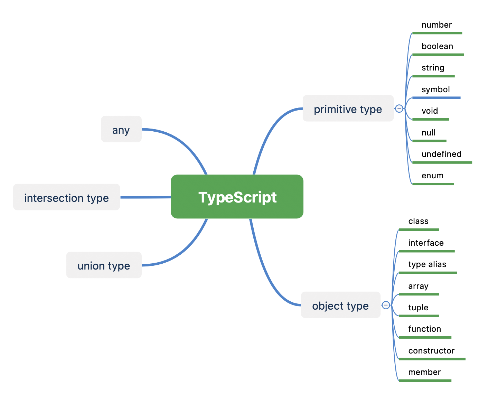

# 类型系统



## any
没有显式指定类型, 并且 ts 无法推断出类型, 会自动使用 any 类型

any 可以与任意类型兼容, 即 any 变量可以赋值给任意类型, 任意类型可以赋值给 any

``` typescript
var x: any;
var y;                  // y: any  
var z: { a; b; };       // z: { a: any; b: any; }

function f(x) {         // f(x: any): void  
    console.log(x);  
}
```

> 编译项 noImplicitAny, 禁用的显示的 any 注解.

## 原始类型

string, number, boolean, symbol, null, undefined, void, enum

### string

string 关键字表示 string 类型

string 字面量是 string 类型

string 类型的行为与全局接口类型 String 一致

```typescript
var s: string;          
var empty = "";         // empty: string = ""  
var abc = 'abc';        // abc: string = "abc"  
var c = abc.charAt(2);  // String 接口的属性
```

> String/Boolean/Number 是合法的类型, 但跟 string 不是一回事, 特指对应的内置对象.

### number

number 关键字表示 number 类型

number 字面量是 number 类型

number 类型的行为与全局接口类型 Number 一致

```typescript
var x: number;
var y = 0;              // y: number = 0  
var z = 123.456;        // z: number = 123.456  
var s = z.toFixed(2);   // Number 接口的属性
```

### boolean

boolean 关键字表示 boolean 类型

boolean 类型只有两个值: true, false

boolean 类型的行为与全局接口类型 Boolean 一致

```typescript
var b: boolean;
var yes = true;         // yes: boolean = true  
var no = false;         // no: boolean = false
```

### null 

null 类型的唯一值是 null 字面量, 所以没有表示 null 类型的关键字(因为不需要)

null 是除 undefined 之外的所有类型的子类型, 所以 null 可以赋值给任意类型

###  undefined

undefined 类型的唯一值是 undefined 字面量, 所以没有表示 undefined 类型的关键字(因为不需要)

undefined 是所有类型的子类型, 所以 undefined 可以赋值给所有类型

### void
void 用于表示函数没有返回值, void 是 null 和 undefined 的子类型, 所以 void 类型的取值只能是 null 和 undefined

``` typescript
function log(message): void {
    console.log(message);
}
```

### enum

enum 类型是用户定义的 number 类型

### symbol


## 对象类型
class, interface, array, tuple, function, constructor,

### array

ts 中的 array 就是元素全部为同一类型的 js array

array 类型基本语法: `type[]`
```typescript
var boolArray: boolean[];
```

array 类型也可以写作 `Array<type>`, 与 `type[]` 等价.
array 类型的接口

```typescript
interface Array<T> {  
    length: number;  
    [x: number]: T;  
    // Other members  
}
```

### tuple

tuple 就是包含不同类型元素的 js array

``` typescript
// tuple 类型
:[ T0, T1, ..., Tn ]

// tuple 字面量
var nameNumber: [string, number];
// Okay
nameNumber = ['Jenny', 8675309];
// Error!
nameNumber = ['Jenny', '867-5309'];
```

### function
两种方式
```typescript
(param1: Type1, param2: Type2, ...) => returnValueType
```

### constructor

```typescript
(param1: Type1, param2: Type2, ...) => returnValueType
```

### class

### interface

interface 用于命名和参数化对象类型, 并将已有的类型组合到一个类型
interface 是一个纯粹的编译时结构, 没有任何运行时表现


包含相同成员的 interface 是等价的, 可以相互替换
``` typescript
interface Name {
    first: string;
    second: string;
}
```

interface 与 .d.ts 与扩展库

classes implements interface


## 联合类型
有些变量可能是多个类型之一, 这时可以使用联合类型来指定其类型
``` typescript
function formatCommandline(command: string[]|string) {
    var line = '';
    if (typeof command === 'string') {
        line = command.trim();
    } else {
        line = command.join(' ').trim();
    } 
    // Do stuff with line: string
}
```

## 交叉类型
注意是是交叉类型而不是交集类型, 这里交叉是并集的意思

result 既是 T 类型也是 U 类型
``` typescript
function extend<T, U>(first: T, second: U): T & U {
    let result = <T & U>{};
    for (let id in first) {
        (<any>result)[id] = (<any>first)[id];
    }
    for (let id in second) {
        if (!result.hasOwnProperty(id)) {
            (<any>result)[id] = (<any>second)[id];
        }
    }
    return result;
}
```

## 类型别名

# 参考资料
https://www.typescriptlang.org/docs/handbook/intro.html

